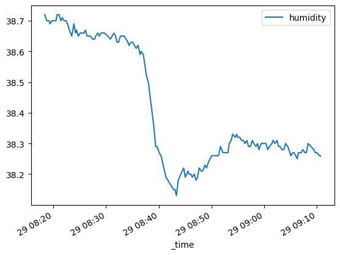

# Connectors
Theese are the supported data connectors

## MQTT Connector

Example usage of the MQTT connector:
```python
connector = MQTTConnector()
connector.start()  # Start the MQTT client in separate thread
connector.subscribe("sensor/temperature")
# connector.subscribe("sensor/#")  # subscribe to wildcard

messages = connector.get_messages()  # get messages
connector.stop()    # stop the connector gracefully
```

Convert timestamp to datetime:
```python
for t in messages['sensor/temperature']['timestamp']:
    print(datetime.datetime.fromtimestamp(t))
```

## InfluxDB Connector

```python
import os
from dotenv import load_dotenv
load_dotenv('path/to/.env')
client = InfluxDBConnector(token=os.environ['INFLUX_ACCESS_TOKEN'])
client.connect()
buckets = client.get_bucket_names()
bucket = 'ruuvitag'
client.set_bucket(bucket=bucket)
tags = client.get_tags()
fields = client.get_fields()
field = 'humidity'
df = client.query_field(field=field, query_return_type='pandas')
df.plot(x='_time', y=field, kind='line')
client.disconnect()
```


